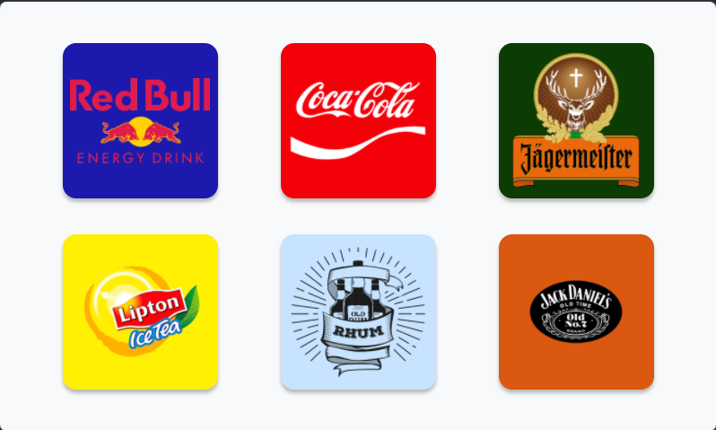
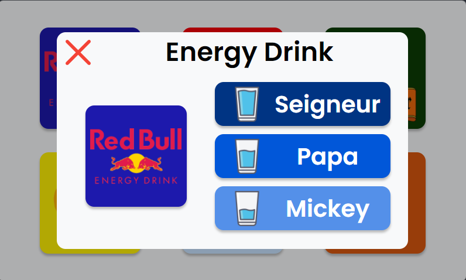

# Bartender V2.0

# Introduction
Bartender is an application that allows you to control a hand built drink dispenser. It is developed in `Node.Js` with `Vue.Js` for the front-end and `Electron` for the back-end. It also uses the `Raspberry Pi` library to control the dispenser pumps. You can find a short video of the dispenser [here](https://www.youtube.com/watch?v=DMKN5MTMvrQ).





# Installation
First of all, check that you have `Node.Js` and `Npm` installed on your PC. Then, you can run the following command at the root of the project to install all the dependencies :
```shell
$ npm install
```
Finally, you can run the following command to open the application :
```shell
$ npm run electron:serve
```

# Drinks and doses
Drinks and doses can be edited in `.json` files located in the `src/data/` directory.

## Measures
After measurement, it takes 49 seconds to pour 30 cl of liquid.